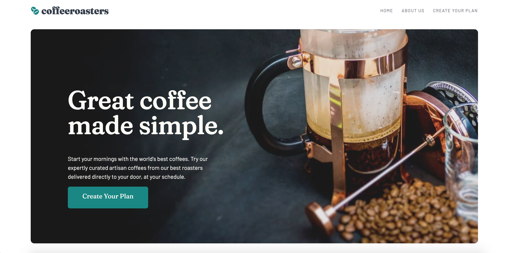

# Frontend Mentor - Coffeeroasters subscription site solution

This is a solution to the [Coffeeroasters subscription site challenge on Frontend Mentor](https://www.frontendmentor.io/challenges/coffeeroasters-subscription-site-5Fc26HVY6). Frontend Mentor challenges help you improve your coding skills by building realistic projects.

## Table of contents

- [Overview](#overview)
  - [The challenge](#the-challenge)
  - [Screenshot](#screenshot)
  - [Links](#links)
  - [Built with](#built-with)

## Overview

This challenge was an opportunity to test my CSS and React skills.

### The challenge

Users should be able to:

- View the optimal layout for each page depending on their device's screen size
- See hover states for all interactive elements throughout the site
- Make selections to create a coffee subscription and see an order summary modal of their choices

### Screenshot

### Links

- Live Site URL: [Coffee-roasters](https://coffee-roasters-eight.vercel.app/create-plan)

### Built with

- Semantic HTML5 markup
- CSS custom properties
- Flexbox
- CSS Grid
- [React](https://reactjs.org/) - JS library
